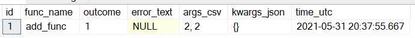
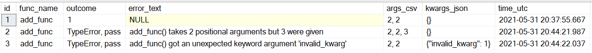

# SQLRecorder


This package serves as a [Python Wrapper](https://wiki.python.org/moin/FunctionWrappers) for use in recording the success or failure of any functions to a SQL table, along with any respective arguments or keyword arguments.

As of 2021-05-31 this package has only been tested with Microsoft SQL Server utilising pyodbc with SQL Server Native Client 11.0 and windows authentication (trusted_connection=yes).

### Instructions

Install the package using `pip install sqlrecorder`
<br>
In your application, `from sqlrecorder import SQLRecorderWrapper`
<br>
Set up your config variables:

```
# instantiate SQLoggerOne as a copy of SQLRecorderWrapper so multiple configs are possible for the one application
SQLoggerOne = SQLRecorderWrapper
# what to do in the event the wrapped function throws an error
SQLoggerOne.config['ON_FAIL'] = 'pass'
# connection string
SQLoggerOne.config['CONNECTION_STRING'] = 'mssql+pyodbc://@DESKTOP-8TLT5OK\\SQLEXPRESS/Test?driver=SQL+Server+Native+Client+11.0?trusted_connection=yes'
# table name which the logs are written to
SQLoggerOne.config['TABLE_NAME'] = 'py_errorlog'
```
### Config:
`ON_FAIL`<br>
`str: 'pass'`, passes when the wrapped function throws an error<br>
`str: 'return'`, returns the function and associated args and kwargs when the wrapped function throws an error<br>
`str: 'exit'`, returns `sys.exit` when the wrapped function throws an error<br>

`CONNECTION_STRING`<br>
`str` The connection string used to connect with the database instance. See: [SQL Alchemy documentation](https://docs.sqlalchemy.org/en/14/core/engines.html)<br>

`TABLE_NAME`<br>
`str` The table name to be created in SQL.<br>

### Sample Success

```
from sqlrecorder import SQLRecorderWrapper

SQLoggerOne = SQLRecorderWrapper
SQLoggerOne.config['ON_FAIL'] = 'pass'
SQLoggerOne.config['CONNECTION_STRING'] = 'mssql+pyodbc://srvr/db?driver=driver?trusted_connection=yes'
SQLoggerOne.config['TABLE_NAME'] = 'py_func_log'

@SQLoggerOne
def add_func(a,b):
    return a+b

add_func(2, 2)
```
Which will send to SQL:



### Sample Errors

Assuming the above code but with the following two calls of `add_func`

```
add_func(2, 2, 3) # invalid, third argument

add_func(2, 2, invalid_kwarg=1) # invalid keyword argument
```

Would update the existing table to:



### TODO:

<ol>
<li>Return NULL/None when len(kwargs) == 0</li>
</ol>